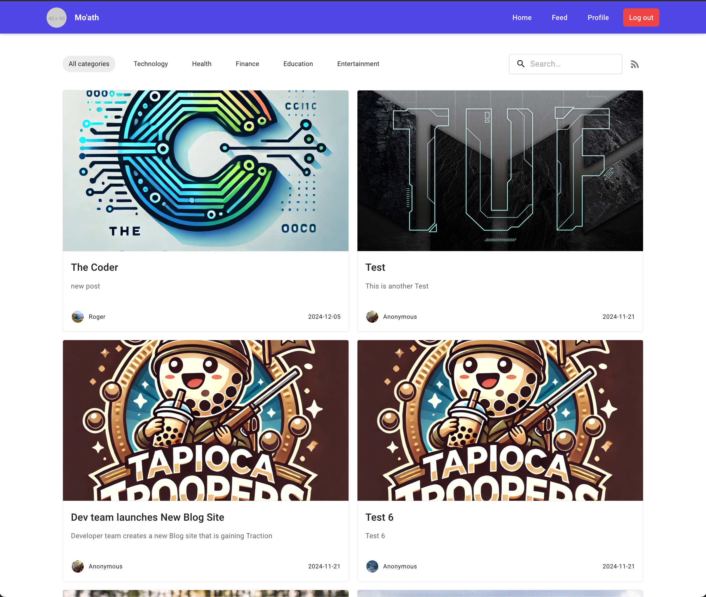
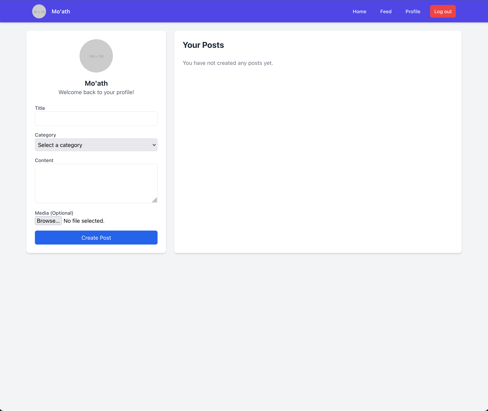
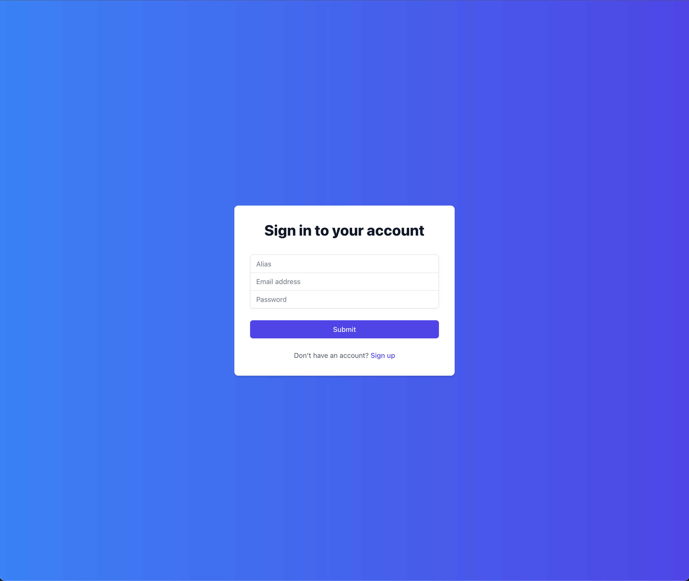
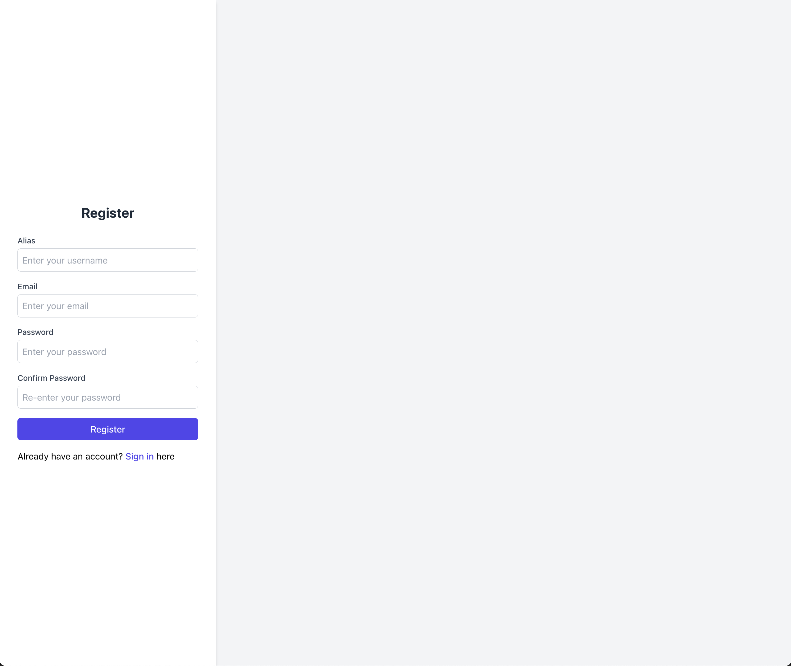

# Tapioca Troopers Blog
This project is for Web Application course.

## To run the project
### Run the Back-end
1. Got to the Back-end project file `cd server`
2. Install the Back-end packages by running `npm install`
3. Run the Back-end `npm run dev`

## Pages

### Blog Feed Page

### Post Creation Page

### SignIn Page

### Register Page

